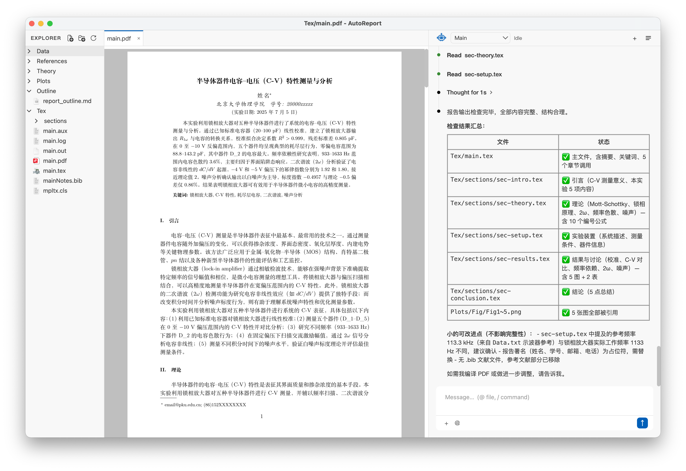
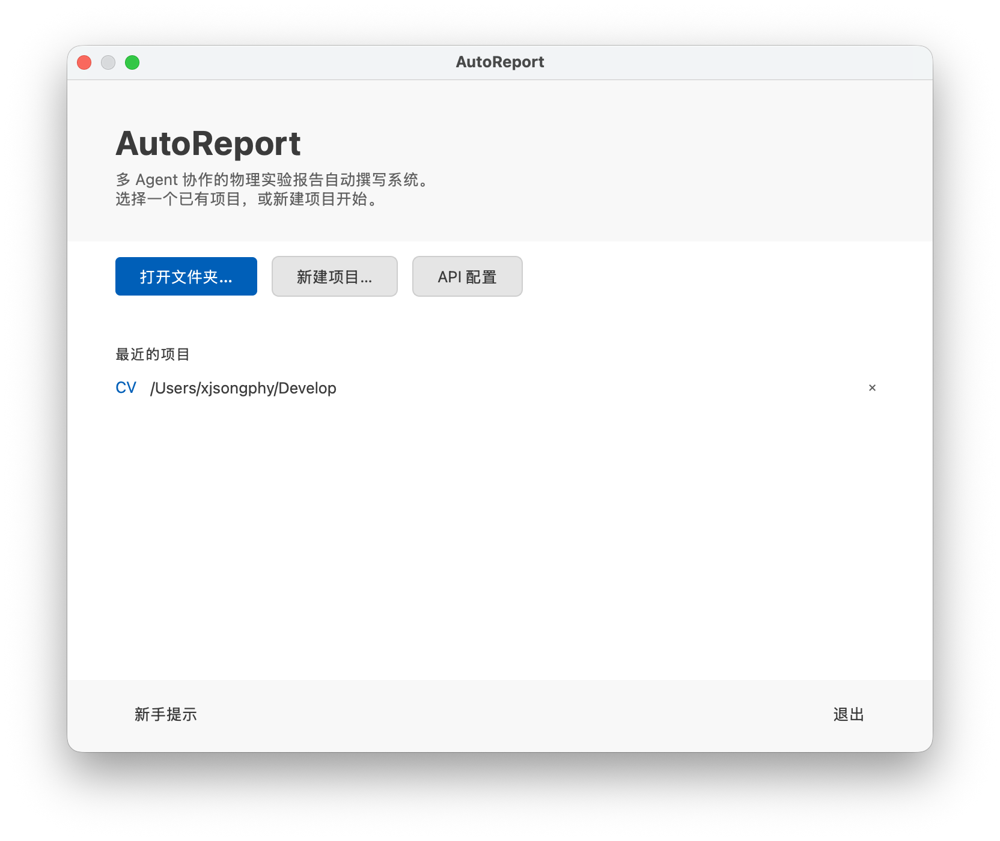
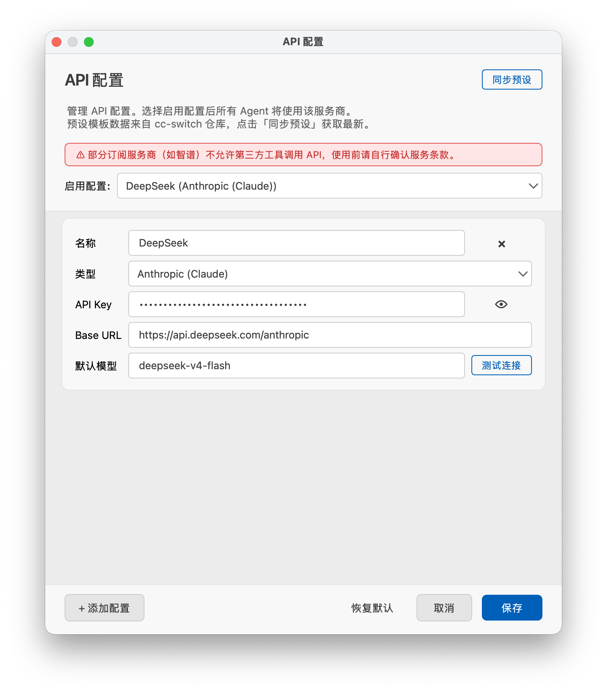

<div align="center">


### A Multi-Agent Collaborative System for Automated Physics Experiment Report Writing

[](#)
[](https://www.python.org/)
[](https://www.riverbankcomputing.com/software/pyqt/)
[](LICENSE)

English | [中文](README_zh.md)

</div>

## Overview

A multi-agent collaborative automated physics experiment report writing system. Users provide experimental data and reference materials, then agents collaboratively generate LaTeX reports through theoretical derivation, data analysis, visualization, and typesetting.

## Features

### Core Capabilities
- **Multi-Agent Collaboration** — Main Agent orchestrates, with four sub-agents (Data Analysis, Plotting, Theory, Report) each specializing in their domain
- **Directory Permission Isolation** — Each agent can only write to designated directories, preventing cross-contamination
- **Waitlist/Todolist Tracking** — Structured task delegation with linked waitlist-todolist chains and auto-notification on completion
- **Checkpoint Rollback** — Automatically creates checkpoints at key nodes; roll back to any historical state
- **Interactive Adjustment** — Users can message any agent at any time for intervention and optimization

### UI/UX (VSCode/Copilot Chat Style)
- **Streaming Responses** — Real-time agent output, word-by-word streaming
- **Switchable Agent Panel** — A single agent chat panel with a dropdown selector to switch among Main / Data Analysis / Plotting / Theory / Report
- **Recent Projects Cache** — VSCode-style recent projects list, cached in `~/.autoreport/recent_projects.json`
- **File Explorer** — VSCode-style file tree with 22px row height, 16px icons, concise labels (Data, References, Theory, Plots, Outline, Tex)
- **Context Chip Bar** — Visual indicator for file/line selections with toggle to include/exclude from messages
- **Chat Interface** — Copilot-style conversation display with proper Markdown rendering and grouped tool calls
- **Slash Commands** — `/clear`, `/new`, `/help`, `/compact`, `/init`

### Developer Tools
- **@ File References** — Type `@` in chat to fuzzy-search and insert file references as Markdown links
- **Selected Line Context** — Text selections in preview pane are automatically appended to agent messages
- **Sub-Agent Debug Mode** — Disconnect from Main Agent channel, test individual agents independently

### LLM Integration
- **Multi-Provider Support** — Anthropic, OpenAI, DeepSeek, etc. Runtime model switching
- **Provider Presets** — 50+ provider templates from [cc-switch](https://github.com/farion1231/cc-switch)
- **Context Auto-Compact** — Automatically trims conversation history when approaching context window limits

## Main Workspace

The main workspace combines the project file tree, document preview, and agent chat timeline in one window. Users can inspect generated LaTeX/PDF output while continuing to interact with the agent team.



## Quick Start

**Prerequisites:** Python >= 3.12, [uv](https://docs.astral.sh/uv/) package manager, TeX distribution, at least one LLM Provider API key.

```bash
git clone https://github.com/xjsongphy/AutoReport && cd AutoReport
uv sync
```

Run:

```bash
autoreport
```

The start window lets users open an existing experiment folder, create a new project, configure API providers, or resume a recent project.



First launch prompts for API configuration. Pre-configure via environment variables:

```bash
export ANTHROPIC_API_KEY="sk-ant-..."
export OPENAI_API_KEY="sk-..."
export DEEPSEEK_API_KEY="sk-..."
autoreport
```

## MinerU Integration

AutoReport uses [mineru-open-api](https://github.com/opendatalab/MinerU) CLI for PDF parsing (PDF, images, DOCX, PPTX, XLSX → Markdown).

**Setup:**

1. Install mineru-open-api:
   ```bash
   curl -fsSL https://cdn-mineru.openxlab.org.cn/open-api-cli/install.sh | sh
   ```
   See [mineru-open-api docs](https://mineru.net/ecosystem?tab=cli) for details.

2. Register at [MinerU](https://mineru.net/apiManage/token) for an API key, then authenticate:
   ```bash
   mineru-open-api auth
   ```

3. The app auto-detects availability on startup and shows a warning if not installed.

Supports batch processing (max 200MB / 600 pages per file), text/image/table/formula extraction.

## Configuration

Configuration file: `autoreport.config.yaml`

The API configuration dialog manages provider presets, active provider selection, API keys, base URLs, and default models.



```yaml
agents:
  defaults:
    model: "anthropic/claude-sonnet-4.5"
    temperature: 0.1
    max_tool_iterations: 200
```

## Debug Mode

```bash
autoreport --debug-agent data_analysis
autoreport --debug-agent data_analysis --debug-agent plotting
```

Valid agents: `data_analysis`, `plotting`, `theory`, `report`

## Project Structure

```
my_experiment/
├── Data/            # Raw experimental data (user input) + analysis results
│   └── Processed/   # Data Analysis Agent output only
├── References/      # Reference materials (PDF, images), custom templates
├── Theory/          # Theory Agent output only
├── Plots/           # Plotting Agent plots and generated images
│   ├── Fig/         # Generated figures
│   └── Scripts/     # Plotting scripts
├── Outline/         # Main Agent report outline and routing notes
└── Tex/             # Report Agent LaTeX source and compiled output
```

### Agent Permissions

| Agent | Write Directory | Read Scope |
|-------|----------------|------------|
| Main Agent | `Outline/` | All directories |
| Data Analysis | `Data/Processed/` | All directories |
| Plotting | `Plots/` | All directories |
| Theory | `Theory/` | All directories |
| Report | `Tex/` | All directories |
| User | `Data/`, `References/` | All directories |

## Architecture

```
autoreport/
├── app.py                 # Entry point: CLI parsing, LoopManager startup
├── config/                # Pydantic-based config (YAML loading, API key validation)
├── core/
│   ├── loops/            # Agent runtime: LoopManager, AgentLoop, MessageBus
│   ├── providers/        # LLM provider abstraction (factory, base classes)
│   ├── prompts/          # Progressive prompt loading (identity → full instructions)
│   ├── tools/            # Tool system (registry, file tools, exec tools, PDF tool, skill tool)
│   ├── checkpoints.py    # Operation-log checkpoints with reversible file operations
│   ├── conversations.py  # Multi-session conversation store
│   ├── file_search.py    # Fuzzy file search for @ references
│   ├── preset_sync.py    # cc-switch preset synchronization
│   └── recent_projects.py# Recent projects cache
├── gui/                  # PyQt6 interface (main window, dialogs, widgets)
│   └── widgets/          # Reusable components (file tree, preview, agent panel)
├── interfaces/           # GUI-backend protocol (protocol definitions, message types)
├── resources/            # Built-in resources
├── templates/            # Built-in templates (agent prompts, report templates)
│   ├── agents/           # Agent prompt files (Markdown)
│   └── reports/          # LaTeX report templates
├── external/             # Git-ignored synced content (presets, skills)
│   ├── cc-switch/        # Provider presets from cc-switch repo
│   └── skills/           # Skill Markdown files
└── utils/                # Logging configuration (loguru)
```

## Development

```bash
# Run tests
uv run pytest -v

# Lint
uv run ruff check autoreport tests
uv run ruff check --fix autoreport tests

# Run with coverage
uv run pytest --cov=autoreport --cov-report=html
```

## UI Icons

Agent type icons are from [Tabler Icons](https://tabler-icons.io/) — 6000+ free SVG icons, MIT License.

## Reference Projects

- [DeepCode](https://github.com/HKUDS/DeepCode) — API config (YAML secrets + env fallback), multi-provider support, error handling
- [cc-switch](https://github.com/farion1231/cc-switch) — Provider presets (50+ providers)
- [nanobot](https://github.com/HKUDS/nanobot) — AgentLoop architecture, tool definitions, compact/command system
- [codex](https://github.com/openai/codex) — UI design patterns, streaming implementation
- [openclaw](https://github.com/openclaw/openclaw) — Personal AI assistant, skills system, multi-channel agent design
- [VS Code](https://github.com/microsoft/vscode) — Editor UI/UX patterns, panel layout, command and extension architecture
- [Claude Code](https://claude.com/claude-code) — Agent chat panel UI/UX (bubble messages, grouped tool calls, streaming, `@` references, slash commands)
- [PKUMpLtX](https://github.com/CastleStar14654/PKUMpLtX) — Built-in LaTeX report template (PKU Modern Physics Laboratory, revtex4-2 based)

## Star History

[](https://www.star-history.com/?repos=xjsongphy%2FAutoReport&type=date&legend=top-left)

## License

MIT License
